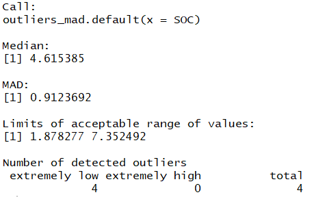
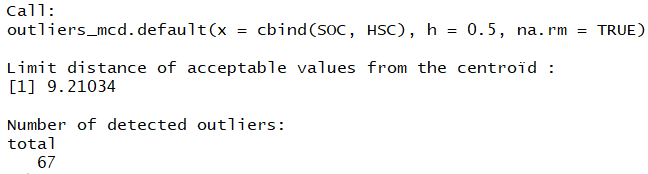

  
```{r setup, include = FALSE}
library("papaja")
library(devtools)
install_github("mdelacre/Routliers")
```

```{r analysis-preferences}
# Seed for random number generation
set.seed(42)
knitr::opts_chunk$set(cache.extra = knitr::rand_seed)
```

“…Most psychological and other social science researchers have not confronted the problem of what to do with outliers – but they should.” [@Abelson_1995, p.69]. The past few years have seen an increasing concern about flexibility in data analysis [@John_et_al_2012; @Simmons_et_al_2011]. When confronted with a dataset, researchers have to make decisions about how they will analyze their data. This flexibility in the data analysis has come to be referred to as “researcher’s degrees of freedom” [@Simmons_et_al_2011]. Even before a statistical test is performed to examine a hypothesis, data needs to be checked for errors, anomalies, and test assumptions. This inevitably implies choices at many levels [@Steegen_et_al_2016], including decisions about how to manage outliers [@Leys_et_al_2018; @Simmons_et_al_2011]. Different choices lead to different datasets, which could possibly lead to different analytic results [@Steegen_et_al_2016]. When the choices about how to detect and manage outliers are based on the outcomes of the statistical analysis (i.e., when choices are based on whether or not tests yield a statistically significant result), the false positive rate can be inflated, which in turn might affect reproducibility. It is therefore important that researchers decide on how they will manage outliers before they collect the data and commit to this pre-specified plan. 

Outliers are data points that are extremely distant from most of the other data points (see below for a more formal definition). Therefore, they usually exert a problematic influence on substantive interpretations of the relationship between variables. In two previous papers [@Leys_et_al_2018; @Leys_et_al_2013], the authors conducted two surveys of the psychological literature that revealed a serious lack of concern for (and even a clear mishandling of) outliers. Despite the importance of dealing adequately with outliers, practical guidelines that explain the best way to manage outliers are not available in the literature. The goal of this article is to fill this lack of an accessible overview of best practices. We will discuss powerful new tools to detect outliers and discuss the emerging practice to preregister analysis plans [@vantveer_2016]. Finally, we will highlight how outliers can be of substantive interest, and how carefully examining outliers may lead to novel theoretical insights that can generate hypotheses for future studies. Therefore, this paper’s aims are fourfold: (1) defining outliers; (2) discussing how outliers could impact the data; (3) reminding what we consider the most adequate way to detect outliers and (4) proposing guidelines to manage outliers, with an emphasis on pre-registration. 

# What is an Outlier?

@Aguinis_et_al_2013 report results of a literature review of 46 methodological sources addressing the topic of outliers, as well as 232 organizational science journal articles mentioning issues about outliers. They collected 14 definitions of outliers, 39 outliers detection techniques and 20 different ways to manage detected outliers. It is clear from their work that merely defining an outlier is already quite a challenge. The 14 definitions differed in the sense that (a) in some definitions, outliers are all values that are unusually far from the central tendency, whereas in other definitions, in addition to being far from the central tendency, outliers also have to either disturb the results or yield some valuable or unexpected insights; (b) in some definitions, outliers are not contingent on any data analysis method whereas in other definitions, outliers are values that disturb the results of a specific analysis method (e.g., cluster analysis, time series, or meta-analysis). 

Two of these 14 definitions of outliers seemed especially well suited for practical purposes. The first is attractive for its simplicity: *“Data values that are unusually large or small compared to the other values of the same construct”* [@Aguinis_et_al_2013, Table 1, p.275]. However, this definition only applies to single constructs, but researchers should also consider multivariate outliers (i.e., outliers because of a surprising pattern across several variables). Therefore, we will rely on a slightly more complicated but more encompassing definition of outliers: “Data points with large residual values”. This definition calls for an understanding of the concept of “residual value”, which is the discrepancy between the observed value and the value predicted by the statistical model. This definition does not call for any specific statistical method and does not restrict the number of dimensions from which the outlier can depart.

## Error Outliers, Interesting Outliers, and Random Outliers

@Aguinis_et_al_2013 distinguish three types of mutually exclusive outliers: *error* outliers, *interesting* outliers and *influential* outliers. We will introduce two modifications to their nomenclature. 

The first modification concerns removing the category of *influential* outliers. Influential outliers are defined by @Aguinis_et_al_2013 as outliers that prominently influence either the fit of the model (model fit outliers) or the estimation of parameters (prediction outliers)\footnote{The Model fit outliers appear for instance when using statistical methods based on the maximum likelihood (and variants) method. Prediction outliers appear when using the more common least squares method (such as in linear regression).}. In our view, according to this definition, all types of outliers could be influential or not [for additional extensive reviews, see @Cohen_et_al_2003; @McClelland_2000]. Moreover, since the influential criterion will not impact how outliers are managed, we will remove this category from our nomenclature. The second modification concerns the addition to a new category that we will name *random* outliers (see Table 1).

*Error* outliers are non-legitimate observations that *“lie at a distance from other data points because they are results of inaccuracies”* [@Aguinis_et_al_2013, p.282]. This includes measurement errors and encoding errors. For example, a “77” value on a Likert scale ranging from 1 to 7 is an error outlier, caused by accidentally hitting the “7” twice while manually entering the data. 

*Interesting* outliers are not clearly errors but could be influenced by potentially interesting moderators \footnote{Note that both error and interesting outliers are influenced by moderators. The moderator of the *error* outlier is identified as being of no theoretical interest and concerns an error (e.g. , coding error). The *interesting* outlier is driven by a moderator that is identified or not and that might potentially be of theoretical interest}. These moderators may or may not be of theoretical interest and could even remain unidentified. For this reason, it would be more adequate to speak of *potentially interesting* outliers. In a previous paper, @Leys_et_al_2018 highlight a situation where outliers can be considered as heuristic tools, allowing researchers to gain insights regarding the processes under examination [see @McGuire_1997]: *“Consider a person who would exhibit a very high level of in-group identification but a very low level of prejudice towards a specific out-group. This would count as an outlier under the theory that group identification leads to prejudice towards relevant out-groups. Detecting this person and seeking to determine why this is the case may help uncover possible moderators of the somewhat simplistic assumption that identification leads to prejudice”* [@Leys_et_al_2018, p.151]. For example, this individual might have inclusive representations of his/her in-group. Examining outliers might inspire the hypothesis that one’s social representation of the values of the in-group may be an important mediator (or moderator) of the relationship between identification and prejudice.

*Random* outliers are values that just randomly appear out of pure (un)luck. Imagine a perfectly well-balanced coin that yields 100 times heads on 100 throws. Random outliers are per definition very unlikely, but still possible. 

Table 1.
*Adjusted nomenclature of outliers*

|                |                                                                            |
|:-------------  | :------------------------------------------------------------------------- |
|Error           |*e.g., coding error*                                                        |
|Interesting     |*e.g., moderator underlying a potentially interesing psychological process* |
|Random          |*e.g., a very large value of a given distribution*                          |

## Univariate and Multivariate Outliers

Another relevant distinction is the difference between univariate and multivariate outliers. Sultan K&ouml;sen is the tallest man currently alive (8ft, 2.8 in/251cm). Because he displays a particularly high value on a single dimension (his height) he can be considered a univariate outlier \footnote{Although he obviously belongs to the human population, and as such is not an error outlier, it was worth detecting this departure from normality. Indeed, his unusual height is caused by an abnormal pituitary gland that never stopped secreting growth hormone. He stopped growing after a surgical treatment. This is a simple example of a univariate outlier that is not attributed to any inaccuracy but that is related to an interesting moderator (the dysfunctional pituitary gland) that could account for the unusual observation.}

Now, let us imagine a cohort of human beings. An observation of a 5 ft 2 in (157 cm) tall person will not be surprising since it is quite a typical height. An observation of 64 lbs (29 kg) will not be surprising either, since many children have this weight. However, weighting 64 lbs *and* being 5 ft 2 in tall is surprising. This example is Lizzie Velasquez, born with a Marfanoid–progeroid–lipodystrophy syndrome that prevents her from gaining weight or accumulating body fat. Values that become surprising when several dimensions are taken into account are called *multivariate* outliers. Multivariate outliers are very important to detect, for example before performing structural equation modeling (SEM), where multivariate outliers can easily jeopardize fit indices [@Kline_2015].

An interesting way to emphasize the stakes of multivariate outliers is to describe the principle of a regression coefficient (i.e., the slope of the regression line) in a regression between to variable Y (set as *DV*) and X (set as *IV*). Firstly, remember that the dot of coordinates ($\bar {X}$, $\bar {Y}$), named G-point (for Gravity-point), necessarily belongs to the regression line. Next, the slope of this regression line can be computed by taking each individual slope of each line linking each data of the cloud and the G-point and multiplying these slopes by an individual weight ($\omega_i$). The weight is computed by taking the distance between the X coordinate of a given observation and the $\bar{X}$ and dividing that distance by the sum of all distances (see equation below). 

$$b_i=\sum\omega_i(\frac{Y_i-\bar{Y}}{ X_i-\bar{X}})= \sum \frac{(X_i-\bar{X})^2}{\sum(X_i-\bar{X})^2} (\frac{Y_i-\bar{Y}}{X_i-\bar{X}})$$

Given this equation, one can see that the impact of an outlying value of $Y_i$ on the regression slope will depend on the distance between the $X_i$ coordinate of this data and the $\bar{X}$. If the data is an outlier on Y but has an X coordinate equal to $\bar{X}$ (i.e. $X_i$=$\bar{X}$), then the $\omega_i$ will be equal to zero (i.e. $\omega_i$ = 0) and there is no consequence of this outlying Y on the slope of the regression line. On the contrary, if Y is an outlier that is also outlying on X (i.e. $X_i$ >> $\bar{X}$ or $X_i$ << $\bar{X}$), then the $\omega_i$ will be high and the influence on the regression slope can be tremendous.


The detection of multivariate outliers relies on different methods than the detection of univariate outliers. Univariate outliers have to be detected as values too far from a robust central tendency indicator, while multivariate outliers have to be detected as values too far from a robust ellipse (or a more complex multidimensional cloud when there are more than two dimensions) that includes most observations [@Cousineau_Chartier_2010]. We will present recommended approaches for univariate and multivariate outlier detection later in this article, but we will first discuss why checking outliers is important, how they can be detected, and how they should be managed when detected.

RAJOUTER FIGURE 1 ici (4 graphiques, 8 points identiques, et ensuite, on en déplace 1, puis on le remet et on déplace le deuxèime, puis on le remet et on déplace le troisième, de sorte qu'entre les quatre graphes, il n'y ait tj que un seul des points qui change!) Note: légende: Effet des valeurs aberrantes (triangle vert, carré orange, cercle bleu) sur le coefficient b1 en fonction de leur distance par rapport à Xmoy. 

# Why Are Outliers Important? 

An extreme value is either a legitimate or an illegitimate value of the distribution. Let us come back on the perfectly well-balanced coin that yields 100 times “heads” in 100 throws. Deciding to discard such an observation from a planned analysis would be a mistake in the sense that, if the coin is perfectly well-balanced, it is a legitimate observation that has no reason to be altered. If, on the contrary, that coin is an allegedly well-balanced coin but in reality a rigged coin with a zero probability of yielding “tails”, then keeping the data unaltered would be the incorrect way to deal with the outlier. In the first scenario, altering (e.g., excluding) the observation implies inadequately reducing the variance by removing a value that rightfully belongs to the considered distribution. On the contrary, in the second scenario, keeping the data unaltered implies inadequately enlarging the variance since the observation does not come from the distribution underpinning the experiment. In both cases, a wrong decision may influence the Type I error (alpha error, i.e., the probability that a hypothesis is rejected when it should not have been rejected) or the Type II error (beta error, i.e., the probability that an incorrect hypothesis is not rejected) of the test. Taking the correct decision will not influence the error rates of the test.

Unfortunately, more often than not, one has no way to knowing which distribution an observation is from, and hence there is no way to being certain whether any value is legitimate or not. Researchers are recommended to follow a two-step procedure to deal with outliers. First, they should aim to detect the possible candidates by using appropriate quantitative (mathematical) tools. As we will see, even the best mathematical tools have an unavoidable subjective component. Second, they should manage outliers, and decide whether to keep, remove, or recode these values, based on qualitative (non-mathematical) information. If the detection or the handling procedure is decided *post hoc* (after looking at the results), then researchers introduce bias in the results. 

# Detecting Outliers

In two previous papers, @Leys_et_al_2013 and @Leys_et_al_2018 reviewed the literature in the field of Psychology and showed that researchers primarily rely on two methods to detect outliers. For univariate outliers, psychologists consider values to be outliers whenever they are more extreme than the mean plus or minus the standard deviation multiplied by a constant, where this constant is usually 3, or 3.29 [@Tabachnick_Fidell_2013].  These cutoffs are based on the fact that when the data are normally distributed, 99.7% of the observations fall within 3 standard deviations around the mean, and 99.9% fall within 3.29 standard deviations. In order to detect multivariate outliers, most psychologists compute the Mahalanobis distance [@Mahalanobis_1930; see also @Leys_et_al_2018 for a mathematical description of the Mahalanobis distance]. Both these methods of detecting outliers rely on the mean and the standard deviation, which is not ideal because the mean and standard deviation themselves can be substantially influenced by the outliers they are meant to detect. Outliers pull the mean towards more extreme values (which is especially problematic when sample sizes are small), and because the mean is further away from the majority of data points, the standard deviation increases as well. This circularity in detecting outliers based on statistics that are themselves influenced by outliers can be prevented by the use of robust indicators of outliers. 

A useful concept when thinking about robust estimators is the *breakdown point* [@Donoho_and_Huber_1983], defined as the proportion of values set to infinity (and thus outlying) that can be part of the dataset without corrupting the estimator used to classify outliers. For example, the median has a breakdown point of .5, which is the highest possible breakdown point. A breakdown point of .5 means that the median allows 50% of the observations to be set to infinity before the median breaks down. Consider, for the sake of illustration, the following two vectors: X= {2, 3, 4, INF, INF, INF} and Z={2, 3, 4, 5, INF, INF}. The vector X consists of 6 observations of which half are infinite. Its median, computed by averaging 4 and INF, would equal infinity and therefore be meaningless. For the vector Z, where less than half of the observations are infinite, a meaningful median of 4.5 can still be calculated. Contrary to the median, both the standard deviation and the mean have a breakdown point of zero: one single observation set to infinity implies an infinite mean and an infinite standard deviation, rendering the method based on standard deviation around the mean useless. The same conclusion applies to the Mahalanobis distance, which also has a breakdown point of 0. 

Since the most common methods psychologists use to detect outliers do not rely on robust indicators, switching to robust indicators is our first recommendation to improve current practices. To detect univariate outliers, we recommend using the method based on the Median Absolute Deviation (MAD), as recommended by @Leys_et_al_2013. The MAD is calculated based on a range around the median, multiplied by a constant (with a default value of 1.4826). To detect multivariate outliers, we recommend using the method based on the MCD, as advized by @Leys_et_al_2018. Note that, although any breakdown point ranging from 0 to .5 is possible with the MCD method, simulations by @Leys_et_al_2018 encourage the use of the MCD with a breakdown point of .25 (i.e. computing the mean and covariance terms using 75% of all data) if there is no reason to suspect that more than 25% of all data are multivariate outlying values. For R users, examples of applications of outliers detection based on the MAD and MCD methods are given at the end of the section. For SPSS users, refer to the seminal papers @Leys_et_al_2018 to compute the MAD, MCD50 (breakdown point = .5) and MCD75 (breakdown point = .25). 

In addition to the outlier detection method, a second important choice researchers have to make is the determination of a plausible criterion for when observations are considered too far from the central tendency. There are no universal rules to tell you when to consider a value as “too far” from the others. Researchers need to make this decision for themselves and make an informed choice about the rule they use. For example, the same cutoff values can be used for the median plus minus a constant number of absolute deviation method as is typically used for the mean plus minus a constant number of *SD* method (e.g., median plus minus 3 MAD). As for the Mahalanobis distance, the threshold relies on a chi-square distribution with k degrees of freedom, where *k* is the number of dimensions (e.g., when considering both the weight and height, *k *= 2). A conservative researcher will then choose a Type I error rate of .001 where a less conservative researcher will choose .05. This can be applied to the MCD method. A criterion has to be chosen for any detection technique that is used. We will provide recommendations in the section “Handling Outliers and Pre-registration” and summarize them in the section “Summary of the main recommendations”.

Finally, it is important to underline that outlier detection is a procedure that is applied only once to a dataset. A common mistake is to detect outliers, manage them (e.g., remove them, or recode them), and then re-apply the outlier detection procedure on the new changed dataset. 

In order to help researchers to detect and visualize outliers based on robust methods, we created an R package (see https://github.com/mdelacre/Routliers). *outliers_mad* and *plot_outliers_mad* functions are created in order to respectively detect and visualise univariate outliers, based on the MAD method. In the same way of thinking, *outliers_mcd* and *plot_outliers_mcd* functions are created in order to respectively detect and visualise multivariate outliers, based on the MCD method. Finally, in a comparative perspective, *outliers_mahalanobis* and *plot_outliers_mahalanobis* are created in order to respectively detect and visualise multivariate outliers, based on the classical mahalanobis method. As an illustration, we used data collected on 2077 subjects the day after the terrorist attacks in Brussels (on the morning of 22 March 2016). We focused on two variables: the sense of coherence [SOC-13 self report questionnaire, @Antonovsky_1987] and anxiety and depression symptoms [HSCL-25, @Derogatis_et_al_1974]. Figure 2 shows the output provided by *outliers_mad* applied on the SOC-13 and Figure 3 shows the plot provided by *plot_outliers_mad* on the same variable.

```{r, MADSOC, fig.cap="Univariate extreme values of sense of coherence [@Antonovsky_1987] detected by the MAD method on a sample of 2077 subjects the day after the terrorist attacks in Brussels (on the morning of 22 March 2016)"}
library(Routliers)
data(Attacks)
SOC <- rowMeans(Attacks[,c("soc1r","soc2r","soc3r","soc4","soc5","soc6","soc7r","soc8","soc9","soc10r","soc11","soc12","soc13")])
plot_outliers_mad(SOC)
```

```{r "", echo=FALSE, fig.width = 100,fig.height=100,out.width = '400px',fig.cap = "Output provided by the outliers_mad function when trying to detect univariate extreme values of sense of coherence [@Antonovsky_1987] on a sample of 2077 subjects the day after the terrorist attacks in Brussels (on the morning of 22 March 2016)"}

```

Figure 4 shows the output provided by *outliers_mcd* performed in order to detect bivariate outliers when considering both the SOC-13 and the HSCL-25, and Figure 5 shows the plot provided by *plot_outliers_mcd* on the same variable.

```{r, MCDSOC, fig.cap="Bivariate extreme values when considering the combination of sense of coherence [@Antonovsky_1987] and anxiety and depression symptoms [@Derogatis_et_al_1974] detected by the MCD method on a sample of 2077 subjects the day after the terrorist attacks in Brussels (on the morning of 22 March 2016)"}
data(Attacks)
SOC <- rowMeans(Attacks[,c("soc1r","soc2r","soc3r","soc4","soc5","soc6","soc7r","soc8","soc9","soc10r","soc11","soc12","soc13")])
HSC <- rowMeans(Attacks[,22:46])
plot_outliers_mcd(cbind(SOC,HSC), h = .5,na.rm = TRUE)
```

```{r "", echo=FALSE, fig.width = 100,fig.height=100,out.width = '400px',fig.cap = "Output provided by the outliers_mad function when trying to detect univariate extreme values of sense of coherence [@Antonovsky_1987] on a sample of 2077 subjects the day after the terrorist attacks in Brussels (on the morning of 22 March 2016)"}

```

The *plot_outliers_mcd* function returns a scatter dot where red points are detected bivariate outliers. Additionnaly, two regression lines are also plotted (i.e. with and without outliers). It allows do easily observe if there is a strong impact of outliers on the regression line.

# Handling Outliers

After detecting the outliers, it is important to discriminate between *error* outliers and other types of outliers. Error outliers should be corrected whenever possible. For example, when a mistake occurs while entering questionnaire data, it is still possible to go back to the raw data to find the correct value. When it is not possible to retrieve the correct value, outliers should be removed. To manage other types of outliers (i.e., interesting and random), researchers have to choose among 3 strategies, which we summarize based on the work by @Aguinis_et_al_2013 as 1) keeping the outliers, 2) removing the outliers, or 3) recoding the outliers. 

*Keeping* outliers (Strategy 1) is a good decision if most of these outliers rightfully belong to the distribution of interest (i.e., provided that we have a normal distribution, they are simply the 0.27% of values expected to be further away from the mean than three standard deviations). However, keeping outliers in the dataset can be problematic for several reasons if these outliers do in fact belong to an alternative distribution. First, a test could become significant because of the presence of outliers and therefore, the results of the study can depend on a single or few data points, which questions the robustness of the findings. Second, the presence of outliers can jeopardize the assumptions of the parametric tests (mainly normality and equality of variances), especially in small sample datasets. This would require a switch from parametric tests to alternative robust tests, such as tests based on the median or ranks [@Sheskin_2004], or bootstrapping methods [@Efron_Tibshirani_1994], while such approaches might not be needed when outliers that do not belong to the underlying distribution are removed.

Note also that some analyses do not have that many alternatives, for example, mixed ANOVA, or factorial ANOVA are very difficult to conduct with nonparametric alternatives, and when alternatives exist, they are not necessarily immune to heteroscedasticity. However, if outliers are a rightful value of the distribution of interest, then removing this value is not appropriated and will also corrupt the conclusions. 

*Removing* outliers (Strategy 2) is efficient if outliers corrupt the estimation of the distribution parameters, but it can also be problematic. First, as stated before, removing outliers that rightfully belong to the distribution of interest artificially decreases the error estimation. In this line of thinking, @Bakker_and_Wicherts_2014 recommend to keep outliers by default since their presence do not seem to compromise much the statistical conclusions and since alternative tests exist (they suggest using the Yuen-Welsch test to compare means). However, their conclusions only concern outliers that imply a violation of normality but not of homoscedasticity. Moreover, the Yuen-Welsch test uses the trimmed mean as indicator of central tendency, which disregard 20% (a common subjective cut-off) of the extreme values (and therefore do not take outliers into account). 

Second, removing outliers lead to the loss of a large amount of observations, especially in datasets with many variables, when all univariate outliers are removed for each variable. When researchers decide to remove outliers, they should clearly report how outliers were identified (preferably including the code that was used to identify the outliers), and when the way to manage outliers was not preregistered, report the results with and without outliers. 

*Recoding* outliers (Strategy 3) avoids the loss of a large amount of data. However, recoding data should rely on reasonable and convincing arguments. A common approach to recoding outliers is Winsorization, where all outliers are transformed to a value at a certain percentile of the data. The observed value of all data below a given percentile observation k (generally *k* = 5) is recoded into the value of the *k*th percentile observation (and similarly, all data above a given percentile observation, i.e., (100 - *k*), is recoded to the value of the (100 - *k*)th percentile). An alternative approach is to transform all data by applying a mathematical function to all observed data points (e.g., to take the log or arcsin) in order to reduce the variance and skewness of the data points [@Howell_1997]. We underline that, in our conception, such recoding solutions are only used for pragmatic reasons (i.e., avoiding the loss of too many data) but not for statistical reasons. When possible, it is always best to avoid such seemingly ad hoc transformations in order to cope with data loss. In other words: (1) we suggest to collect enough data so that removing outliers is possible without compromising the statistical power; (2) if outliers are believed to be random, then it is acceptable to leave them as they are; (3) if, for pragmatic reasons, researchers are forced to keep outliers that they detected as outliers influenced by moderators, the Windsorization or such transformations are acceptable.

It is crucial that researchers understand that handling outliers is a non-mathematical decision. Mathematics can help to set a rule and examine its behavior, but the decision of whether or how to remove, keep or recode outliers is non-mathematical. As such, it is up to researchers to make a reasonable choice for a criterion and technique and justify this choice. We developed the nomenclature of outliers provided earlier to help researchers to make such decisions. Error outliers need to be removed when detected as such, as they are not valid observations of the investigated population. Both interesting and random outliers can either be kept, recoded, or excluded. Ideally, interesting outliers should be removed and studied in future studies, and random outliers should be kept. Unfortunately, raw data generally do not allow researchers to easily differentiate interesting and random outliers from each other. In practice, we will therefore treat both of them similarly.  

Because multiple justifiable choices are available to researchers, the question of how to manage outliers is a source of flexibility in the data analysis. To prevent the inflation of Type 1 errors, it is essential to specify how to manage outliers following *a priori* criteria, before looking at the data. For this reason, researchers have stressed the importance of specifying how outliers will be dealt with ‘specifically, precisely, and exhaustively’ in a preregistration document [@Wicherts_et_al_2016]. We would like to add that the least ambiguous description of how outliers are managed takes the form of the computer code that is run on the data to detect (and possibly recode) outliers. If no decision rules were preregistered, and several justifications are possible, it might be advisable to report a sensitivity analysis across a range of justifiable choices to show the impact of different decisions about managing outliers on the main results that are reported [see, for example, @Saltelli_et_al_2000]. If researchers conclude that interesting outliers are present, this observation should be discussed, and further studies examining the reasons for these outliers could be proposed, as they offer insight in the phenomenon of interest and could potentially improve theoretical models. 

# Pre-registering Outlier Management

More and more researchers [@Klein_et_al_2018; @Nosek_et_al_2018; @vantveer_2016] stress the need to pre-register any material prior to data collection. Indeed, as discussed above, *post hoc* decisions can cast a shadow on the results in several ways, whereas pre-registration avoids an unnecessary deviation of the Type I error from the nominal alpha level. We invite researchers to pre-register: 
1) the method they will use to detect outliers, including the criterion (i.e., the cutoff).
2) the decision how to manage outliers.

Several online platforms allow one to preregister a study. The Association for Psychological Science (APS, 2018) non exhaustively listed the Open Science Framework (OSF), ClinicalTrials.gov, AEA Registry, EGAP, the WHO Registry Network, and AsPredicted. 

However, we are convinced that some ways to manage outliers may not be predicted but still be perfectly valid. To face situations not envisaged in the pre-registration or to deal with instances where sticking to pre-registration seems erroneous, we propose three other options: 
1) Asking judges blind to the research hypotheses to make a decision on whether or not outliers that do not correspond to the *a priori* decision criteria should be included. This should be done prior to further analysis, which means that detecting outliers should be among the first steps when analyzing data. 
2) Sticking to the pre-registered decision regardless of any other argument, since keeping an a priori decision might be more credible than selecting what seems the best option *post hoc*.
3) Pre-registering a coping strategy for such unexpected outliers. For example, researchers could decide *a priori* that all detected outliers that do not fall in a predicted category shall be kept (or removed) regardless of any *post hoc* reasoning. 
Lastly, we strongly encourage researchers to report information about outliers, including the number of outliers that were removed, and the values of the removed outliers. Best practice would be to share the raw data, as well as the code that was used to detect (and possibly recode) outliers. 

# Perspectives

Although we provided some guidelines to manage outliers, there are interesting questions that could be addressed in meta-scientific research. Given the current technological advances in the area of big data analysis, machine learning or data collection methods, psychologists have more and more opportunities to work on large data sets [@Chang_et_al_2018;@Yarkoni_Westfall_2017]. In such context, an interesting research question is whether outliers in a database appear randomly, or whether outliers seem to follow a pattern that could be detected in such large data sets. This could be used to identify the nature of the outliers that researchers detect and provide some suggestions for how to manage them. Four situations can be foreseen: (1) outliers are randomly distributed and quite rare; (2) outliers are randomly distributed and numerous; (3) outliers follow a pattern but are quite rare; (4) outliers follow a pattern and are numerous. The case (1) suggests that outliers belong to the distribution of interest (if the number of outliers is consistent with what should be expected in the distribution), and, as such, should be kept. The case (2) would be difficult to interpret. It would suggest that a large amount of values is randomly influenced by an unknown moderator (or several) able to exert its influence on any variable. We could be tempted to keep them for pragmatic reasons (i.e., to avoid the loss of a large number of data) but should then address the problem in discussion. In (3) and (4), a pattern emerges, which might suggest the presence of a moderator (of theoretical interest or not). Whenever a pattern emerges (e.g., when the answers of a given participant are consistently outlying from one variable to another), we recommend removing outliers and, eventually, trying to understand the nature of the moderator in future studies. 

To go one step further in this line of thinking, some outliers could appear randomly whereas others could follow a pattern. For example, one could suspect that outlying values close to the cutoff belong more likely to the distribution of interest than outliers far from the cutoff (since the further they are the more likely they belong to an alternative distribution). Therefore, outliers close to the cutoff could be randomly distributed in the data base, whereas further outliers could follow a pattern. This idea is theoretically relevant, but implies serious hurdles to be overcome, such as devising rules to split outliers in two subsets of interest (one with a pattern the other randomly distributed) without generating false detection. 

In conclusion, a useful tool could be a mathematical algorithm that evaluates the detected outliers in a database in order to detect patterns. This tool could also determine whether one subset of outliers follows a pattern whereas other subsets are randomly distributed. It could guide researchers’ decisions on how to cope with these types of outliers. However, we currently do not have such a tool and we will leave this topic for further studies. 

# Summary of the main recommendations 

1) Correct or delete obvious erroneous values; 
2) Do not use the mean or variance as indicators but the MAD for univariate outliers, with a cut off of 3 [for more information see @Leys_et_al_2013], or the MCD75 (or the MCD50 if you suspect the presence of more than 25% of outlying values) for the multivariate outliers, with a chi-square at p = .001, instead [for more information see @Leys_et_al_2013].
3) Decide on outlier handling before seeing the results of the main analyses and preregister the study at, for example, the Open Science Framework (http://openscienceframework.org/)
4) Decide on outlier handling by justifying your choice of keeping, removing or correcting outliers based on the soundest arguments, at the best of researchers knowledge of the field of research.
5) If preregistration is not possible, report the outcomes both with and without outliers or on the basis of alternative methods [such as Welsch tests, Yuen-Welsch test, or nonparametric tests, see for example @Bakker_and_Wicherts_2014; @Leys_and_Schumann_2010; @Sheskin_2004]
6) Report transparently about how outliers were handled in the result section.


# Conclusion
 
In this paper, we stressed the importance of outliers in several ways: to detect error outliers; to gain theoretical insights by identifying new moderators that can cause outlying values; to improve the robustness of the statistical analyses. We also underlined the problem resulting from the decision on how to manage outliers based on the results yielded by each strategy. Lastly, we proposed some recommendations based on the quite recent opportunity provided by platforms allowing to pre-register researchers’ studies. We argued that, above any other considerations, what matters most in order to maximize the accuracy and the credibility of a given research is to take all possible decisions on outliers’ detection and coping strategies prior to any data analysis. 

\newpage

# References

\setlength{\parindent}{-0.5in}
\setlength{\leftskip}{0.5in}